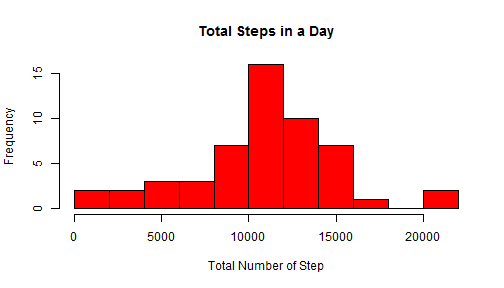

Reproducible Research Peer Assignment 1
=============================================

###Loading and Preprocessing the data

1. Loading the activity.csv file.

```r
activity <- read.csv ("E:./activity.csv")
```

```
## Warning in file(file, "rt"): cannot open file 'E:./activity.csv': No such
## file or directory
```

```
## Error in file(file, "rt"): cannot open the connection
```

```r
head (activity)
```

```
##   steps       date interval
## 1    NA 2012-10-01        0
## 2    NA 2012-10-01        5
## 3    NA 2012-10-01       10
## 4    NA 2012-10-01       15
## 5    NA 2012-10-01       20
## 6    NA 2012-10-01       25
```

2. Pre-Processing the data (Changing  class of date variable)

```r
activity$date <- as.Date (activity$date)
```

###What is mean total number of steps taken per day?

1. Removing all NA values

```r
act_good <- activity [ complete.cases(activity),]
head (act_good , n=  3)
```

```
##     steps       date interval
## 289     0 2012-10-02        0
## 290     0 2012-10-02        5
## 291     0 2012-10-02       10
```

2. Calculating total number of steps each day

```r
total <- aggregate (steps~date, act_good, sum)
head (total , n =3)
```

```
##         date steps
## 1 2012-10-02   126
## 2 2012-10-03 11352
## 3 2012-10-04 12116
```

3. Plotting a histogram and printing mean and median values

```r
hist (total$steps ,breaks = 10, col = "red" , xlab = "Total Number of Step"  , main = "Total Steps in a Day")
```

 

```r
mean (total$steps)
```

```
## [1] 10766.19
```

```r
median (total$steps)
```

```
## [1] 10765
```

###What is the average daily activity pattern?
1. Aggregating by interval and Calculating Mean

```r
avg_int <- aggregate (steps~interval, act_good , mean)
head (avg_int)
```

```
##   interval     steps
## 1        0 1.7169811
## 2        5 0.3396226
## 3       10 0.1320755
## 4       15 0.1509434
## 5       20 0.0754717
## 6       25 2.0943396
```

2. Plotting the mean

```r
with (avg_int , plot (steps~interval , type = "l" , xlab = "Interval" , ylab = "Average Steps"))
```

 

3. Checking which 5 minute interval has maximum average steps

```r
index <- which.max (avg_int$steps)
avg_int$interval[index]
```

```
## [1] 835
```

###Imputing missing values

1. Getting the number of missing values

```r
idx <- is.na (activity$step)
sum (idx)
```

```
## [1] 2304
```

We will use the mean number of steps per 5 minute interval to fill out the missing values.

2. Copying datasets into another data frame and  Replacing those NA values with  average values corresponding to same intervals


```r
activity_mod <- activity
for (i in idx)
    {
    activity_mod$steps[idx] = avg_int$steps[ avg_int$interval == activity_mod$interval[idx]]
    }
head (activity_mod)
```

```
##       steps       date interval
## 1 1.7169811 2012-10-01        0
## 2 0.3396226 2012-10-01        5
## 3 0.1320755 2012-10-01       10
## 4 0.1509434 2012-10-01       15
## 5 0.0754717 2012-10-01       20
## 6 2.0943396 2012-10-01       25
```

3. Plotting histogram and calculating mean and median of total number of steps per day


```r
total2 <- aggregate (steps~date , activity_mod , sum)
head (total2)
```

```
##         date    steps
## 1 2012-10-01 10766.19
## 2 2012-10-02   126.00
## 3 2012-10-03 11352.00
## 4 2012-10-04 12116.00
## 5 2012-10-05 13294.00
## 6 2012-10-06 15420.00
```

```r
hist (total2$steps ,breaks = 10, col = "red" , xlab = "Total Number of Step"  , main = "Total Steps in a Day")
```

 

```r
mean (total2$steps)
```

```
## [1] 10766.19
```

```r
median (total2$steps)
```

```
## [1] 10765.59
```

Compared to original data , mean has not changed but median has seen a very small change.

###Are there differences in activity patterns between weekdays and weekends?

1. Determining the type of day

```r
activity_mod$wd <- weekdays (activity_mod$date)
for (i in 1:nrow(activity_mod))
    {
    if (activity_mod$wd[i] == "Sunday" | activity_mod$wd[i] == "Saturday")
        activity_mod$wd[i] = "weekend"
    else 
        activity_mod$wd[i] = "weekday"
}
head (activity_mod$wd)
```

```
## [1] "weekday" "weekday" "weekday" "weekday" "weekday" "weekday"
```

2. Converting it to a factor

```r
activity_mod$wd <- as.factor (activity_mod$wd)
head (activity_mod$wd)
```

```
## [1] weekday weekday weekday weekday weekday weekday
## Levels: weekday weekend
```

3. Plotting the Graph

```r
library(ggplot2)
avg_int_wd <- aggregate (steps~interval+wd,activity_mod , mean)
head (avg_int_wd)
```

```
##   interval      wd     steps
## 1        0 weekday 2.3179245
## 2        5 weekday 0.4584906
## 3       10 weekday 0.1783019
## 4       15 weekday 0.2037736
## 5       20 weekday 0.1018868
## 6       25 weekday 1.5273585
```

```r
ggplot (avg_int_wd , aes (x = interval  , y = steps)) +geom_line() + facet_grid (wd~.)+ xlab ("Interval") + ylab ("Average Number of Steps") + theme_bw()+ ggtitle("Weekend and Weekday Distribution")
```

 

As clearly seen from the plot, the average activity on weekend is lower than on weekdays.

